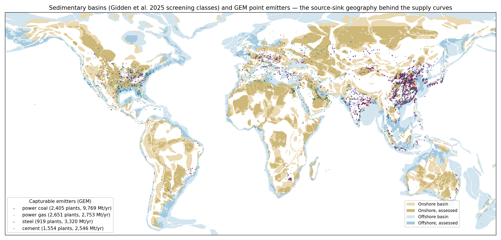
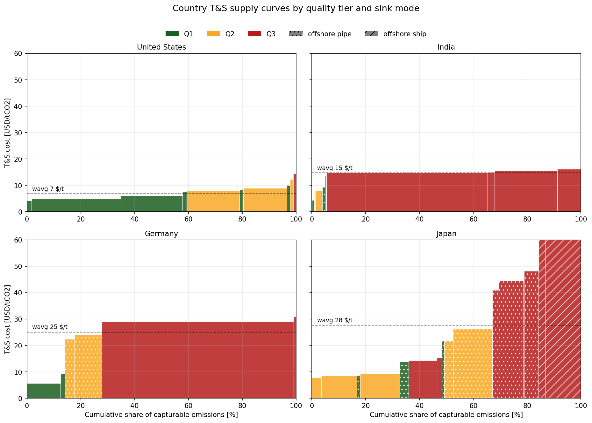
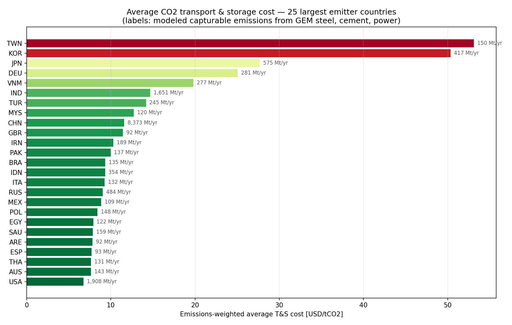

################################
Carbon capture and storage (CCS)
################################

KiNESYS represents CO2 transport and storage (T&S) with country-level **supply curves** built
from plant-level emitter locations and site-level storage geometries, and constrains CO2
injection with **pressure-limited physics** — replacing the legacy treatment (global potentials
from Hendriks 2004 / Dooley 2005 downscaled by weight attributes, flat cost steps, no
injection-rate constraint).

Four features distinguish this treatment from standard global ESOM practice:

* **Spatially grounded T&S costs.** Every GEM-tracked steel, cement, and power plant is matched
  to its cheapest viable storage option (onshore pipeline, offshore pipeline, or ship);
  costs come from engineering-economic pipeline functions with direction-aware trunk-sharing,
  not from a flat $/t adder.
* **Injection rates as physics, not stock fractions.** Per-region injection-rate ceilings derive
  from basin-scale pressure-buildup modeling (CO2BLOCK class), so under-assessed regions
  (India, Brazil) are not starved by assessment-coverage bias.
* **Co-varying supply-curve steps.** Each step carries capacity, injection-rate share, T&S cost,
  and a quality/provenance tier jointly — the model sees that a cheap tranche may also be the
  rate-limited or speculative one.
* **Deployment realism as scenario-bounded ceilings.** Per-country deployment ceilings anchored
  on each country's actual project pipeline, historical technology-analog growth rates, and
  projected capturable emissions — a pessimistic/optimistic pair that prevents the optimizer
  from deploying CCS anywhere faster than institutions plausibly allow, while leaving the
  cost-driven allocation *within* those bounds to the model.

   The source-sink geography behind the supply curves: global sedimentary basin footprints
   (Gidden et al. 2025 screening classes, darker = assessed) and the ~7,500 GEM-tracked
   capturable point emitters (coal and gas power, steel, cement; marker size ∝ emissions).
   Distances from each plant to its viable sinks drive the transport-cost differentiation.

Storage supply
==============

Each country's storage is broken into steps of
``category x distance-band x quality-tier x sink-mode``:

.. list-table::
   :header-rows: 1
   :widths: 22 78

   * - Dimension
     - Values
   * - Category
     - Saline aquifer; Petroleum (depleted fields; undiscovered-petroleum excluded)
   * - Distance band
     - 0–50 / 50–200 / 200–500 / 500–1500 / >1500 km (emitter-to-sink, emissions-weighted)
   * - Quality tier
     - Q1 directly assessed sites (OGCI); Q2 assessed basins / prudent tranche; Q3 unassessed or proxy
   * - Sink mode
     - Onshore pipeline; offshore pipeline; offshore ship

Capacity is anchored on the OGCI CO2 Storage Resource Catalogue (Cycle 5, site-level
P10/P50/P90), with CO2StoP (EU), the Fan et al. (2025) fine-grid dataset (China), and
oil & gas field proxies (OGIM) — tier discounts and thin-catalogue gap-fill are quantified
on the Gidden et al. (2025) nesting of technical potential, prudent (suitability-screened)
limit, and O&G-infrastructure overlap. NatCarb (US) serves as an informational cross-check
only.

Injection-rate and deployment constraints — three layers
=========================================================

**Layer 1 — regional physical ceiling.** Pressure-limited injection rates per basin from an
open-parameter CO2BLOCK re-run over the 765-basin skeleton of Smith et al. (2024), calibrated
to their published global physical maxima, apportioned to supply-curve steps by capacity, and
emitted as ACT_BND per region and process at every milestone year (declining from the 30-year
to the end-of-century rate, reflecting basin pressurization; interpolation is precomputed —
no TIMES-side interpolation is relied on). China uses explicit fine-grid rates; petroleum uses
voidage replacement. The ceiling is deliberately loose (global saline sum an order of
magnitude above deployment scenarios): it binds only where basins are genuinely small.

**Layer 2 — global deployment build-rate.** A single global user constraint
(``GLB_CO2Sto_BuildRate``) caps total storage activity along a logistic ramp calibrated on
the Zhang, Jackson & Krevor (2024) Monte Carlo growth model (Low / Central / High; Central
D(2050) ≈ 5.6 Gt/yr). Because the budget is global, the model allocates scarce deployment
capability across regions economically — no per-region rescaling, no starvation of
under-assessed emitters.

**Layer 3 — per-country deployment ceilings (pess/opt scenario pair).** Geology bounds what a
basin can take (Layer 1) and global industry dynamics bound how fast the world can build
(Layer 2), but neither stops the optimizer from concentrating the entire global budget in one
cheap region — unconstrained runs deploy China at 2.3 Gt/yr by 2030, a rate no jurisdiction
has approached. Hard per-country Mtpa ceilings (2030–2070) close this gap, literature-anchored
at every parameter and emitted as two scenario blocks (``DeployPess`` / ``DeployOpt``) that
run alongside — not instead of — the global build rate:

* **2030 anchor:** the country's actual project pipeline from the IEA CCUS Projects Database
  (2026 edition) — operational and under-construction storage capacity plus attrition-weighted
  planned capacity (optimistic keeps 60% of plans, pessimistic 10%; attrition rates citable to
  Kazlou et al. 2024, Abdulla et al. 2020, Wang et al. 2021).
* **Growth phase:** the Kazlou et al. (2024) technology-analog ladder — optimistic follows
  wind's 2000s growth (26%/yr) then nuclear's 1970s (16%/yr), decaying to mature-industry
  rates; pessimistic holds CCS's own historical 8%/yr throughout. Where Zhang et al. provide
  fitted national growth distributions, the ladder is cross-checked and capped at the fitted
  90th percentile (this binds for Indonesia).
* **Asymptote:** capturable emissions — 85% of the country's capturable base (optimistic), or
  cement + steel + a quarter of power (pessimistic) — projected along country-resolved SSP2
  baseline pathways (Gütschow et al. 2021), so late-century headroom grows where emissions
  grow (India, SE Asia).

The most instructive output is China: its optimistic 2050 ceiling is ~0.7 Gt/yr despite
world-class geology, because its *project pipeline* is thin — the ceilings encode
institutional readiness, which neither geology nor global growth dynamics capture. Countries
without characterized storage receive no ceiling (absent capacity bounds them at zero);
countries with storage but no projects are seeded with a small takeoff (1.0 Mt from 2035
optimistic / 0.3 Mt from 2040 pessimistic). Global brackets validate against independent
markers: 2030 pess/opt of 0.16/0.42 Gt/yr contains the Kazlou-feasible 0.37; 2050 of
0.78/6.44 Gt/yr contains both the current-trajectory extrapolation (~0.7) and the Zhang
Central 5.59; the USA optimistic 2050 ceiling (1.72 Gt/yr) sits at the Princeton NZA high
case (1.7).

Transport and storage costs
===========================

Emitters (GEM steel and cement trackers with route-resolved emission factors; the GEM power
fleet) are assigned to sinks by geodesic distance per country. Pipeline costs follow
McCoy & Rubin engineering economics with diameter economies of scale and regional construction
factors; corridor flows are shared among co-assigned plants (direction-aware trunk-sharing).
Ship transport (liquefaction + port + vessel) engages beyond the pipeline/ship crossover and
is decisive for coastal emitters far from onshore basins (Japan, Korea). Countries with major
CCS policy restrictions (per Gidden et al. S4) have onshore storage demoted. Storage unit
costs use ZEP/NETL anchors by category and tier.

Resulting country averages (emissions-weighted) span roughly $7/t (USA) to $28/t (Japan) with
ship-dominated Korea higher — consistent with the Smith & Herzog (2021) $4–45/t envelope, and
with the finding that whether transport matters is strongly geography-dependent.

**Pessimistic cost scenario (PessCost).** Alongside the central curves, a deliberate cost
*bound* stacks five individually citable pessimisms multiplicatively: regional-high transport
(×1.4, Baek et al.), no hub coordination (every plant pays plant-scale pipeline costs — the
trunk-sharing adjustment disabled), ZEP high-case storage anchors, a brine-handling
(pressure-management) adder on unappraised saline tranches (Anderson 2019/2020), and a
first-of-a-kind premium of +50% fading to zero by 2045 (Rubin's FOAK/NOAK convention; overrun
evidence per Rasool 2025). Because the pessimisms stack, PessCost sits outside any single
literature anchor by construction: Japan/Korea-type curves reach $54–87/t, intentionally
breaching the Smith & Herzog envelope. It brackets T&S cost risk and must not be read as a
central estimate.

   Country T&S supply curves (steps colored by quality tier, hatched by offshore mode).
   Four archetypes: the US is cheap and assessed (Q1/Q2); India is cheap on distance but
   unassessed (Q3 dominates — screening, not resource, binds); Germany is policy-restricted
   onshore with a North Sea offshore option; Japan puts 40% of its capturable emissions on
   offshore pipelines and moves onto ship for the ~16% beyond the ship crossover (~80% of
   the curve).

   Emissions-weighted average T&S cost for the 25 largest emitter countries. The spread —
   $7/t (USA) to >$50/t (Korea, Taiwan) — is the regional differentiation that a flat
   global $10/t assumption erases.

Validation
==========

The dataset is validated against seven benchmarks: the NZA US deployment rate and well
arithmetic, Lin et al. (2024) China steel T&S component, the Smith & Herzog cost envelope,
announced-hub locations falling in the cheapest steps, ceiling-ordering checks, and the
Smith et al. (2024) cross-country distribution of pressure-limited resources. The deployment
ceilings carry their own bracket checks (Kazlou-feasible 2030 capacity, Zhang Central 2050,
NZA USA high case) plus a per-country cross-check against the Zhang fitted national
distributions, and a structural guarantee that the pessimistic trajectory never exceeds the
optimistic one.

Known limitations
=================

Emitter locations are today's plant stock; transport is distance-band-averaged (no routing or
endogenous network investment); cross-border sink-sharing (e.g. Northern Lights) is a model
representation question, not a dataset property; offshore permeability priors are weak for the
North Sea, Red Sea, and NW Shelf, making UK/Norway/Yemen/Australia physical ceilings
conservative.

For the deployment ceilings specifically: values beyond 2070 are held flat; ceilings exist
only for countries with characterized storage (a deliberate scope decision — countries
without it are bounded at zero by absent capacity anyway); import-driven storage growth
(Iceland-type mineralization hubs serving foreign CO2) is out of scope, so such countries
hold at their project-pipeline anchor. And because ceilings sum linearly within a model
region, they lose bite where a large emitter shares a region with storage-rich neighbours —
the build reports every region that merges a top-20 emitter with other countries (e.g.
Germany inside a single EU region, or Southeast Asian emitters pooled in an Asia-other
region), so the regionalization choice is made consciously per model instance.

Data sources
============

Key sources: OGCI CO2 Storage Resource Catalogue Cycle 5; Smith, Hampson & Krevor (2024,
IJGGC); De Simone & Krevor (2021, IJGGC — CO2BLOCK); Gidden et al. (2025, Nature); Zhang,
Jackson & Krevor (2024, Nature Communications); Fan et al. (2025, Scientific Data); CO2StoP
(EU JRC); NETL NatCarb; OGIM v2.7; Global Energy Monitor steel/cement trackers; McCoy & Rubin
(2008); Kim et al. (2024); Baek et al. (2026); ZEP (2011); Smith, Morris & Herzog (2021);
Larson et al. (2021, Princeton Net-Zero America); Lin et al. (2024).

For the deployment ceilings and PessCost: IEA CCUS Projects Database (2026 edition);
Kazlou, Cherp & Jewell (2024, Nature Climate Change); Abdulla et al. (2020, Environmental
Research Letters); Wang et al. (2021); Gütschow et al. (2021, Earth System Science Data —
country-resolved SSP pathways); Anderson (2019/2020, IJGGC — active pressure management);
Rubin et al. (FOAK/NOAK convention); Rasool et al. (2025).
