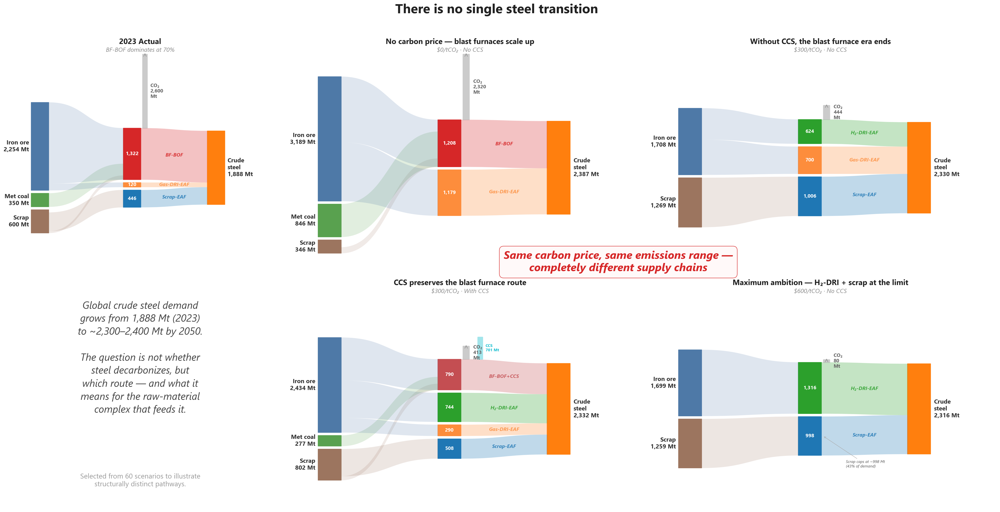
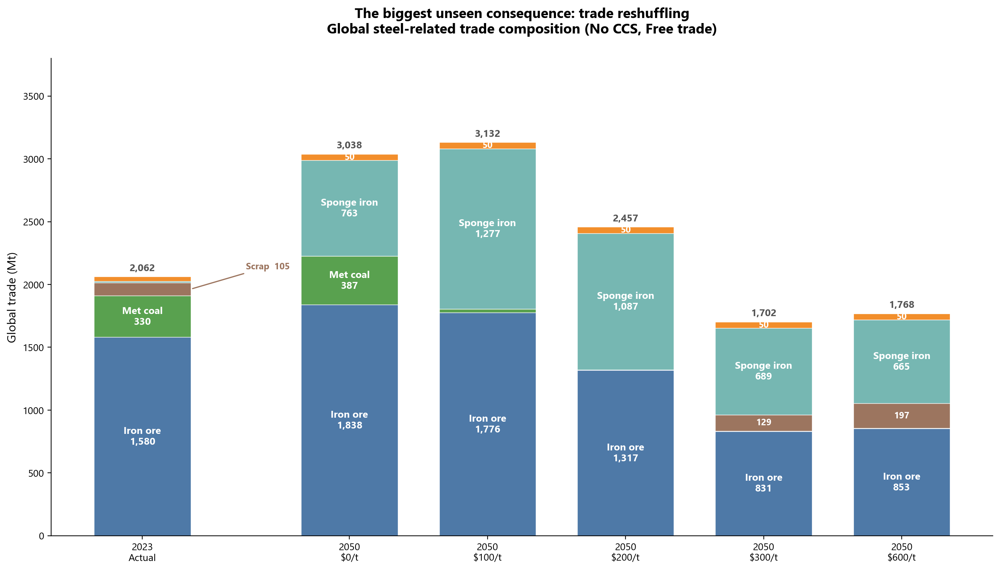

########
Industry
########

* Fuel consumption by sub-sector sourced from IEA energy balance. The breakdown of the industrial sectors can be seen below, together with the correspondence with the sectoral breakdown used in the IEA energy balances

    .. csv-table:: Industry sub-sectors represented in KiNESYS
        :file: tables/industrial sectors breakdown.csv
        :widths: 10,20,45,25
        :header-rows: 1

* End-use fuel consumption splits into energy services sourced from 2018 MECS

    .. csv-table:: Energy services in KiNESYS
        :file: tables/MECS services.csv
        :widths: 10,30,60
        :header-rows: 1

* Physical production of industries sourced from USGS and FAOStats
* New technologies (producing energy services) sourced from EPA-US9r model

Petrochemicals
==============

The petrochemical industry supplies the materials the rest of the economy is
built from, and it is the one industrial sector where most of the carbon is not
burnt but embodied — it leaves the refinery as feedstock and ends up in the
product. That makes it structurally different from steel or cement, and it is
why the sector is represented here as an explicit chemistry: a network of
processes converting named molecules into named molecules, rather than an energy
intensity applied to a tonnage.

Scope and Coverage
------------------

**How the sector is assembled**

The chemistry lives in a hand-maintained workbook, ``VT_KiNESYS_petchem.xlsx``:
66 processes and 62 commodities across 23 sheets, each sheet a product family
with its own coefficient tables and costs. A small pipeline of six scripts sits
beside it and regionalises two things — existing steam cracker capacity, and
product demand. Everything else about the technology is entered by hand and
reviewed by hand.

This is worth stating because it sets what can be changed quickly and what
cannot. Adding a region or refreshing demand is a pipeline run. Adding a
process, a product or a route is an edit to the workbook.

**Products**

62 commodities, of which 23 carry an explicit demand projection. The chain runs
from feedstocks through olefins and aromatics to polymers and finished
intermediates:

.. list-table::
   :header-rows: 1
   :widths: 28,72

   * - Family
     - Commodities
   * - Olefins
     - ethylene, propylene, butadiene, isobutene
   * - Aromatics
     - benzene, toluene, xylene, ethylbenzene, styrene, pygas
   * - Polymers
     - LDPE, HDPE, LLDPE, polypropylene, PVC, polystyrene
   * - Vinyls chain
     - EDC, VCM, chlorine, caustic soda, HCl
   * - Nitrogen chain
     - ammonia, urea
   * - Oxygenates
     - methanol, ethylene oxide, ethylene glycol, propylene oxide,
       propylene glycol, acetic acid, vinyl acetate, 2-EH, MTBE
   * - Industrial gases
     - hydrogen, oxygen, nitrogen, argon, carbon monoxide

**Processes**

Steam cracking is modelled on three feedstocks — naphtha, ethane and propane —
each with a conventional furnace, an electrically heated variant, and a variant
with carbon capture, so nine cracker processes in all. Around that sit
propane dehydrogenation, catalytic reforming of naphtha with and without
capture, hydrodealkylation and toluene disproportionation for aromatics, the
full chlor-alkali and vinyls chain through three cell technologies, and the
polymerisation routes: Ziegler-Natta, bulk and emulsion, and dedicated LDPE,
HDPE, LLDPE and PVC processes.

Ammonia is Haber-Bosch, fed by hydrogen from either steam methane reforming or
electrolysis. Methanol has four routes — coal, gas, gas with capture, and green
hydrogen with captured CO₂. Steam for the whole sector comes from eight boilers
covering electricity, gas, coal, hydrogen and biomass, five of them with capture
variants.

**Feedstocks**

Feedstock enters through nine explicit bridge processes that connect the host
energy system to the sector's internal commodities: ethane, methane, propane,
naphtha, coal, hydrogen, captured CO₂, coal tar, and a gasoline return stream.
Keeping the bridge explicit is what lets the sector's feedstock carbon be
accounted separately from its process energy.

Decarbonization levers represented
----------------------------------

**Electrification of steam cracking.** Electric crackers exist for all three
feedstocks and are real technology choices, not a scaling assumption. They
replace furnace fuel with roughly 10–13 units of electricity per unit of
feedstock throughput, which is the trade the model is being asked to evaluate:
cracking becomes a large new electricity load in exchange for eliminating the
furnace flue gas.

**Carbon capture** is available on the three crackers, on gas-based methanol, on
catalytic reforming of naphtha, and on the gas, coal and biomass boilers.

**Carbon utilisation** is implemented rather than described. Urea production
consumes CO₂ as a physical input, and green methanol consumes captured CO₂
together with hydrogen, drawing on a dedicated ``ind-ccu_co2`` commodity that
carries CO₂ eligible for conversion into fuels and products.

**Hydrogen** is consumed by ammonia synthesis, by green methanol, and by HCl
production, and is produced either by reforming or by electrolysis, so the
grey-to-green transition is a choice inside the sector rather than an assumption
about it.

Emissions and the capturable set
--------------------------------

Process chemistry emissions are carried on a dedicated ``pc_co2`` commodity
rather than inferred from fuel — steam methane reforming, coal and gas methanol
synthesis and the crackers all emit onto it explicitly. Combustion emissions
from furnace fuel and boilers arrive through the host fuel commodities in the
usual way. ``pc_co2`` is inside the host's capturable industrial emissions
group, so petrochemical process CO₂ can genuinely be captured.

Feedstock carbon is tracked separately from process energy. In the reference
case the sector consumes about 37,700 PJ as feedstock against about 16,100 PJ
as process energy, and the feedstock figure sits within a few percent of the
IEA's non-energy use statistics — which is the strongest calibration evidence
the sector has, since feedstock is stoichiometric and admits no efficiency
argument.

Regional coverage, and its main limitation
------------------------------------------

Demand is projected for 23 products across the model's regions and the base-year
world total is about 979 Mt. Existing capacity is a different matter, and this
is the most important caveat in the sector.

**Only steam crackers carry existing capacity.** Operating crackers are placed
from an ethylene asset database across 35 regions, with committed and
under-construction units added separately for 9 more. Ammonia, methanol,
chlor-alkali, the polymers and every downstream intermediate have no existing
stock at all, so from the model's point of view they can be built anywhere, in
any quantity, from the first period. Build-rate constraints limit how fast that
happens, but not where.

The practical consequence is that the sector answers questions about cracker
siting and feedstock slate much better than it answers questions about where
ammonia or methanol production is located today and what it would cost to move.

.. note::

   **Planned, not yet in the model.** Existing capacity for the non-cracker
   chain — ammonia, methanol and chlor-alkali in particular, all of which have
   well-documented asset registers. Also planned: a natural gas liquids
   fractionation step, since ethane supply currently reaches the crackers
   without passing through the separation that produces it.

Demand
------

Product demand is specified as explicit levels from 2020 to 2030, followed by a
single annual growth rate carrying each product to 2050. The 2020–2030 levels
come from market data; the growth rate is fitted to that decade and then damped,
because an unmodified extrapolation of a single decade's growth over twenty
further years produces implausible tonnages. The damping is a judgement, and it
is the largest single discretionary assumption in the sector.

Model Outputs
-------------

- **Feedstock slate by region** — which molecules the crackers are actually
  eating, and how that shifts as relative gas and oil prices move.
- **Process energy and feedstock carbon reported separately**, which is
  necessary in a sector where most of the carbon never becomes CO₂ inside the
  model boundary.
- **Electrification uptake** — how much cracking capacity converts to electric
  heating, and what that adds to industrial electricity demand.
- **Capture and utilisation flows**, including CO₂ routed into urea and into
  green methanol.
- **Hydrogen demand** split between reforming and electrolysis.

Planned extensions
------------------

.. list-table::
   :header-rows: 1
   :widths: 32,68

   * - Extension
     - Why it matters
   * - Existing capacity outside crackers
     - Ammonia, methanol and chlor-alkali are unconstrained greenfield in every
       region, so the model cannot see stranding or relocation for most of the
       sector
   * - Bio-based feedstocks
     - Bio-naphtha, bioethanol-to-ethylene and methanol-to-olefins are the main
       defossilisation route for embodied carbon and none of them is
       represented; biomass currently appears only as a boiler fuel
   * - Fibres and the polyester chain
     - PTA, PET and the synthetic fibre chain are absent, which leaves a large
       share of textile-bound petrochemical demand outside the model
   * - Synthetic rubbers
     - Butadiene is produced but has no downstream polymerisation
   * - Polyethylene grade resolution
     - LDPE, HDPE and LLDPE exist as separate products but share a single
       demand series, so grade substitution cannot be examined
   * - Natural gas liquids fractionation
     - Ethane reaches crackers without the separation step that produces it,
       which distorts the feedstock economics
   * - Process energy calibration
     - Modelled process energy sits about a third below the IEA's reported
       figure, a gap that is documented but not closed
   * - Syngas as a traded intermediate
     - Co-production is described in the sector's own literature but syngas is
       not a commodity here

Iron and Steel
==============

Steel is the largest industrial source of CO₂ and the sector where the choice
between decarbonization pathways has the widest consequences — not only for
emissions, but for which mines stay open, which ports stay busy, and where
ironmaking physically happens. KiNESYS models it as a full material chain from
ore to finished steel, built on a plant-level asset database, and set inside an
energy system that simultaneously decides the electricity, hydrogen and biomass
those pathways compete for.

Scope and Coverage
------------------

**How the sector is assembled**

The existing fleet comes from the Global Energy Monitor iron and steel tracker:
every plant, its route, its capacity and its vintage. That becomes a set of
country-tagged processes carrying vintaged existing capacity, so a 1990s blast
furnace retires on its own schedule rather than a sector average. Alongside it
sits a region-generic menu of greenfield technologies the model may build
anywhere from its start year.

As with the other industrial sectors, the output is a pair of workbooks: one
country-level and region-agnostic, one carrying the model's region set through
availability mapping, demand and discount rates.

**Production routes in the existing fleet**

Ten route types, each instantiated per steel-producing country and per vintage:

.. list-table::
   :header-rows: 1
   :widths: 26,74

   * - Route
     - What it covers
   * - Coke ovens
     - Coking coal to metallurgical coke, with coke oven gas recovered
   * - Sinter and pellet plants
     - Agglomeration of ore fines and concentrate for blast furnace or DRI feed
   * - Blast furnace
     - Hot metal from coke and agglomerate, with blast furnace gas recovered
   * - Basic oxygen furnace
     - Hot metal and scrap to crude steel
   * - Gas-based DRI
     - Midrex-type shaft furnace on natural gas
   * - Coal-based DRI
     - Rotary kiln, the dominant route where gas is unavailable
   * - Electric arc furnace
     - Scrap-based steelmaking
   * - DRI-fed electric arc furnace
     - Sponge iron melted with scrap
   * - Rolling and finishing
     - Crude to finished steel, returning home scrap at a 94% yield

**The greenfield technology set**

Nineteen technologies the model may build, spanning incremental improvement to
breakthrough:

- Conventional replacements — sinter, pellet, blast furnace, gas and coal DRI,
  BOF, EAF, DRI-fed EAF, coke ovens, rolling
- Efficiency variants — coke ovens with heat recovery, electrified rolling,
  near-net-shape casting
- Hydrogen routes — hydrogen direct reduction, gas-DRI with hydrogen blending,
  blast furnace with tuyère hydrogen injection
- Capture variants — blast furnace and BOF with capture
- Breakthrough — molten oxide electrolysis, direct electrolytic ironmaking

Hydrogen direct reduction consumes about 6.5 GJ of hydrogen and 0.75 GJ of
electricity per tonne of sponge iron, on top of 1.42 tonnes of pellets. It and
molten oxide electrolysis carry explicit cost learning curves rather than static
capital costs, because both are pre-commercial and their economics in 2050 are
a function of how much gets built before then.

**Material commodities**

Nine material commodities carry the chain: iron ore, sinter, pellets, pig iron,
sponge iron, crude steel, scrap, slag, and finished steel as the demand
commodity. Energy and process gases — electricity, gas, coke, coal, hydrogen,
blast furnace gas and coke oven gas — are the host system's own carriers, which
is what puts steel in competition with every other sector for them.

Slag is tracked because it leaves the sector: it is the highest-quality
supplementary cementitious material there is, and the cement module consumes it.

**Energy coefficients are calibrated, not assumed**

Rather than apply literature energy intensities uniformly, the sector calibrates
its coefficients against IEA energy balances. Reported blast furnace, coke oven
and iron and steel energy for each country is divided by that country's actual
production from the plant database, and the result is blended with literature
priors according to how credible the observation is. Capacity utilisation is
separately calibrated against worldsteel production statistics.

This matters because the alternative — nameplate capacity times a global
intensity — misses by a wide margin in exactly the countries where the sector
is growing fastest.

**Scrap**

Scrap availability is projected per country to 2050 from steel stock
accumulation, and enters as an upper bound on a domestic scrap supply process.
Home scrap returns from rolling within the model. The projection distinguishes
obsolete, prompt and home streams in its source data, but the model consumes a
single pooled scrap commodity.

Key Features for Decarbonization Analysis
-----------------------------------------

**Hydrogen-based direct reduction.** The complete replacement of natural gas or
coal with hydrogen, producing sponge iron with near-zero direct emissions and a
very large hydrogen appetite. Because hydrogen is a system commodity here rather
than a sector assumption, the model prices it against every other hydrogen use
and against the renewable electricity needed to make it.

**Molten oxide electrolysis.** Direct electrolytic ironmaking, available late
and expensive, included so that the long-horizon question — what happens if
electrochemistry works — can be asked rather than assumed away.

**Scrap-based steelmaking.** The circularity ceiling is a physical result rather
than an input. Scrap availability is set by how much steel was made in previous
decades and how long it lasts, and the model consistently finds scrap-EAF
capping around 40–45% of global crude steel demand even under maximum
decarbonization pressure. The remainder must come from primary iron, which is
what keeps iron ore in the picture in every scenario.

**Process efficiency.** Modern blast furnaces, heat-recovery coke ovens,
electrified rolling and near-net-shape casting, each with its own capital cost,
so efficiency competes against fuel switching on economics rather than being
imposed.

**Regional contextualisation.** Capital costs are differentiated by region
through industry-specific discount rates derived from sector betas, with
first-of-a-kind premiums applied to pre-commercial technologies. Iron ore supply
carries country-level mining costs. Resource endowment, not just technology
cost, decides where routes locate.

Carbon capture
~~~~~~~~~~~~~~

Capture is represented, but it is worth being precise about where.

Steel's combustion emissions arrive on the host system's industrial CO₂
commodities, and those sit inside the host's capturable industrial emissions
group, with a dedicated commodity for CO₂ captured from fossil combustion in
iron and steel. So capture is available to the sector and does real work in
scenario comparisons — the results below were produced this way.

What that mechanism cannot do is distinguish one blast furnace from another. It
acts on the sector's emissions in aggregate rather than on a specific process,
so the model decides how much steel CO₂ to capture, not which plant captures it.

.. note::

   **Planned, not yet in the model.** Process-level capture. Blast furnace and
   BOF capture variants are defined with 90% capture rates, but as currently
   emitted they carry the capital cost and energy penalty of capture **without
   the captured CO₂ flow** — which makes them strictly worse than their
   unabated equivalents and means they will never be built. Wiring the capture
   flow through is what would let retrofit economics, capture rates by route
   and the survival of specific incumbent assets be examined properly, rather
   than only the sector-level question of how much to capture.

International trade
-------------------

Steel decarbonization is as much a story about restructuring global trade as
about changing technology, and five commodities carry that story: iron ore,
coking coal, steel scrap, sponge iron and crude steel.

Iron ore is the dominant seaborne dry bulk today. Coking coal is concentrated
among a few exporters and disappears entirely under deep decarbonization. Scrap
trade grows with EAF capacity. Sponge iron barely features in today's trade but
becomes a major flow when direct reduction gravitates to regions with cheap gas
or renewable hydrogen and ships the intermediate product to steelmakers
elsewhere. Crude steel is traded as semi-finished product, subject to
constraints reflecting reheating costs, quality control and industrial policy.

Restricting crude steel trade forces the model to use sponge iron as the primary
mechanism for international material flow — a choice with large consequences for
ports, shipping and regional industrial structure.

.. note::

   Trade links for these commodities are configured in the host model rather
   than emitted by the steel sector build. A host assembled from the sector
   workbooks alone will have the full production chain but no trade, and its
   regions will each have to meet their own demand.

Model Outputs
-------------

- **Energy and emissions by route and region**, including technology-specific
  emission intensities and the indirect emissions that follow from electricity
  and hydrogen sourcing.
- **Technology adoption** — hydrogen DRI penetration, EAF expansion against the
  scrap ceiling, capture volumes, and the investment those imply.
- **Cost and competitiveness** — production cost by route, the green premium on
  crude steel, and the effect of carbon border adjustment.
- **Material flows** — ore demand by region, coking coal requirements, scrap
  circularity rates, and hydrogen demand for steel.
- **Visualisation** — Sankey diagrams of material flow for any scenario and
  region, trajectory charts across large scenario ensembles, and trade
  composition and net-position charts.

Illustrative Findings
---------------------

The following illustrate the kind of insight the model produces when scenario
dimensions — carbon price, capture availability, technology cost, trade regime —
are varied systematically. They are representative, not prescriptive.

   **Sankey quartet — four structurally distinct steel futures at 2050.** Each
   panel traces material flows from raw inputs (left) through steelmaking routes
   (centre) to crude steel output (right), with CO₂ exit flows shown upward. The
   2023 baseline (top-left) is dominated by blast furnaces; the four 2050
   scenarios show how the system transforms under different carbon price and
   capture availability assumptions. Panels sharing the same carbon price
   (bottom pair) achieve similar emissions reductions with completely different
   supply chains.

**Structurally distinct futures at the same carbon price.** Under a moderate
carbon price with capture available, the blast furnace route can survive,
preserving the iron ore and coking coal supply chain. Under the same carbon
price without capture, blast furnaces are eliminated entirely: direct reduction
and scrap-based EAF dominate, coal disappears, and the energy mix shifts to gas,
hydrogen and electricity. Both achieve comparable emissions reductions of 75–85%
below baseline, but the industrial structures — and therefore the
infrastructure, trade and employment implications — are completely different.

This is the sector's central finding, and it is an argument for modelling
capture availability as a scenario dimension in its own right rather than
folding it into a carbon price.

   **Global steel-related trade composition — from today to five carbon-price
   futures.** Each bar decomposes total seaborne trade by commodity. Iron ore
   dominates today; under decarbonization coking coal disappears, sponge iron
   surges, and the total initially rises before falling.

**Trade reshuffling, not just trade reduction.** Steel-related global trade can
initially *increase* under low-to-moderate carbon prices, as direct reduction
concentrates in gas- and renewables-rich regions and ships sponge iron globally.
At higher carbon prices total volumes decline, but the composition is
unrecognisable: coking coal disappears, iron ore demand halves, and sponge iron
becomes the dominant traded intermediate.

**Bounded green premium.** Across a wide range of scenarios the model-implied
cost of crude steel rises by roughly 20–35% under ambitious decarbonization
relative to a no-policy baseline — significant for a commodity-grade product,
but far below the two- to three-fold premiums sometimes cited.

**No purely circular future.** Even under maximum scrap utilisation, EAF
production from scrap caps around 40–45% of global crude steel demand. The
remaining 55–60% must come from primary iron, so ore continues to be mined and
traded in every future. The question is whether it feeds blast furnaces or
direct reduction plants.

**Hydrogen consumption at scale.** Deep decarbonization implies hydrogen
consumption by steel alone on the order of 25–60 Mt per year by 2050 — a
substantial fraction of projected global clean hydrogen supply, and a critical
input to hydrogen infrastructure planning.

Cross-sector coupling
---------------------

Steel does not decarbonize in isolation, and the couplings run in both
directions.

It competes for electricity, hydrogen, biomass and capture capacity with every
other sector, and those competitions decide which route is affordable. It also
supplies: blast furnace slag is the best supplementary cementitious material
available, and the cement sector depends on it to reduce clinker content. A
steel pathway that eliminates blast furnaces therefore removes cement's cheapest
abatement option at the same time. Neither sector modelled alone would see it.

Planned extensions
------------------

.. list-table::
   :header-rows: 1
   :widths: 32,68

   * - Extension
     - Why it matters
   * - Process-level capture flow
     - Capture variants are defined but emitted without the captured CO₂, so
       they are currently unbuildable and retrofit economics cannot be examined
   * - Trade links emitted with the sector
     - The five traded commodities are configured host-side, so a host built
       from the sector workbooks alone has no steel trade at all
   * - Scrap quality grades
     - Obsolete, prompt and home scrap are distinguished in the source data but
       pooled into one commodity, so scrap quality cannot constrain product mix
   * - Fluxes and refining agents
     - Limestone and dolomite are consumed in reality and carry calcination
       emissions; neither is a commodity here
   * - Secondary refining and casting as stages
     - Ladle refining and continuous casting are absorbed into rolling, so
       their energy and their electrification potential are not visible
   * - Existing-fleet retrofit economics
     - Existing capacity enters through vintaged stock without investment
       costs, so the choice between retrofitting and replacing an asset is not
       priced

Non-Metallic Minerals
=====================

Cement, brick, lime, glass and ceramics are ISIC 23, which the IEA reports as a
single ``NONMET`` subtotal. KiNESYS models all five together as one module,
``INMM``, because they share raw materials, share a statistical envelope, and
compete for the same alternative fuels. Between them they are the largest source
of industrial *process* CO₂ in the world economy — CO₂ that comes out of the
limestone rather than out of the fuel, and which no amount of fuel switching can
touch.

.. list-table:: Non-metallic minerals as modelled
   :header-rows: 1
   :widths: 20,15,15,50

   * - Sub-sector
     - Output
     - Energy
     - Basis of the production estimate
   * - Cement
     - 3,881 Mt
     - 11,304 PJ
     - Global Energy Monitor plant database, 3,884 plants, calibrated to USGS
   * - Brick
     - 2,755 Mt
     - 5,209 PJ
     - Six country studies covering 68% of world energy; Olsson et al. 2025
   * - Lime
     - 430 Mt
     - 1,978 PJ
     - USGS; ten named producers account for 315 Mt
   * - Ceramics
     - 326 Mt
     - 1,560 PJ
     - Acimac/MECS tile survey, twelve producers
   * - Glass
     - 175 Mt
     - 1,391 PJ
     - China NBS flat glass, proxies elsewhere

Two things about that table are worth stating plainly, because they shape
everything downstream.

**Cement is built differently from the other four.** It rests on a plant-level
asset database — every kiln in the world, with its capacity, vintage and
technology — so the model carries the existing fleet as vintaged stock with
country-specific retirement schedules. The other four have no such database
anywhere. For them the model carries a tonnage, an energy intensity, and a menu
of kiln technologies with a base-year mix over it. The two halves therefore
answer different questions well: cement can be asked about stranded assets and
retirement timing, brick and lime cannot.

**The five do not fit inside the reported statistics.** Modelled energy for the
five comes to roughly 21,400 PJ against an IEA ``NONMET`` of 16,340 PJ. That is
not an error to be tuned away — see
`Reconciliation with the IEA balances`_, where it turns out to be the single
most informative result the module produces.

Scope and Coverage
------------------

**How the sector is assembled**

The module is emitted as a pair of workbooks. One is region-generic and carries
the technology — processes, costs, lifetimes, output coefficients, fuel
converters. The other carries everything that has a region dimension —
calibrated energy inputs, base-year activity bounds, and demand. Changing the
model's region set rebuilds only the second.

Processes for brick, lime, glass and ceramics carry no region in their names.
This is deliberate and it is a correctness requirement, not a convenience: a
process named after the region that happened to have it in the base year exists
only in that region, so a kiln absent from a region's base-year mix could never
be built there in any later period either. Africa had no zigzag brick kilns in
2023; under a region-named convention Africa could never build one — the
cheapest abatement option in the entire sector, foreclosed as a side effect of a
naming choice. Every kiln therefore exists everywhere from the start, the
base-year fleet is expressed as bounds rather than as existence, and from the
second period the model chooses freely.

Cement is the exception: its processes are country-tagged, because there the
country detail is real observed asset data rather than an artifact.

**Shared raw materials**

Limestone, clay and gypsum are quarried by sector-neutral processes rather than
by cement's own. Cement pulls about 80% of the world's quarried limestone, but
lime kilns buy 1.8 tonnes of the same rock per tonne of quicklime, and glass
takes it in the batch. Quarrying carries diesel for drilling, blasting and
haulage and electricity for primary crushing — 203 PJ for cement alone, about
1.8% of its energy.

**Fuel routing**

Each sub-sector has its own kiln-heat commodity, produced from the host
industrial fuel commodities by explicit converters:

.. list-table::
   :header-rows: 1
   :widths: 30,70

   * - Heat commodity
     - Fuels permitted
   * - ``inm_cem_kilnheat``
     - coal, gas, oil, biomass (two cost tiers)
   * - ``inm_brk_kilnheat``
     - coal, biomass, gas, oil
   * - ``inm_lim_kilnheat``
     - coal, gas, oil, biomass
   * - ``inm_gls_furnheat``
     - gas, oil, coal
   * - ``inm_cer_kilnheat``
     - gas, coal, biomass, oil

They are separate rather than shared because the fuels are not interchangeable.
A brick clamp kiln burns rice husk and a glass furnace cannot — particulates and
alkali ash ruin the melt. A single shared heat commodity would let the model
fire float glass on crop residue. Note in particular that **biomass is not
available to glass**, and that this is a physical constraint rather than an
omission.

Which fuel is burnt is otherwise the model's choice. The base-year kiln mix is
pinned; the base-year fuel mix is reported as an audit trail but is not imposed,
except in cement where the alternative-fuel share is explicitly bounded.

Cement
------

Scope
~~~~~

Cement is represented as four stages, quarry to product, with a technology
choice at three of them:

.. code-block:: text

   diesel + electricity                        -> quarry   -> limestone, clay, gypsum
   limestone + clay + electricity              -> raw mill -> raw meal
   raw meal + kiln heat                        -> kiln     -> clinker + process CO2
   clinker + SCM + gypsum                      -> grinding -> cement
   coal/gas/oil/biomass                        -> converters -> kiln heat
   slag/fly ash/pozzolan/limestone filler      -> blender    -> SCM

That comes to 1,527 processes over 166 countries, built from the Global Energy
Monitor plant database and calibrated against USGS production.

**Kiln technologies.** Dry precalciner (3.30 GJ/t clinker), dry preheater
(3.60), and wet (5.50), plus a preheater-to-precalciner retrofit available where
preheater capacity survives. Kiln type, capacity and vintage come from the plant
database; where the database does not record precalciner status it is inferred
within physical bounds rather than assumed.

**Existing stock is vintaged.** Kilns, mills and grinding plants carry
vintage-specific lifetimes, so a 1970s line retires on its own schedule rather
than on a sector average. Those schedules are floored so that nothing recorded
as operating today retires before 2035 — cement plants get refurbished rather
than replaced, and 1970s kiln shells are routinely still turning.

**Raw grinding is a lever.** Ball mills at 15 kWh/t of meal against vertical
roller mills at 11, with the base year split 40/60. Separating the stage out of
the kiln coefficient moves no energy; it makes about 37 PJ of headroom visible
to the optimiser that was previously buried in an assumption.

Decarbonization levers represented
~~~~~~~~~~~~~~~~~~~~~~~~~~~~~~~~~~

**Alternative fuels, with an adoption ramp.** Kilns switch fuel by switching
converters rather than by switching kiln process, so fuel choice is independent
of kiln technology. The biomass and waste-derived share is bounded by a ceiling
derived from the kiln stock and its retirement schedule — precalciner kilns can
take far more alternative fuel than wet kilns can. That ceiling is a technical
frontier and reaching it takes time, so it is ramped from each region's observed
base-year substitution rate up to the frontier by 2040. Without the ramp the
model jumps to the frontier in the first period, which is a statement about
thermodynamics rather than about how fuel supply chains actually develop.

**Gas access as a physical constraint.** Whether a kiln can switch to natural
gas depends on whether gas physically reaches it. The share of each country's
kiln capacity within reach of an existing or under-construction pipeline or LNG
terminal is computed from plant coordinates and gas infrastructure geography,
and bounds the gas share accordingly.

**Clinker substitution.** The clinker-to-cement ratio is where the largest
near-term abatement in the sector sits, and it is modelled as an explicit
blending decision rather than an assumed trajectory. A blender process takes
four supplementary cementitious materials and produces the SCM stream that
grinding consumes:

.. list-table::
   :header-rows: 1
   :widths: 30,20,50

   * - Material
     - Cementitious yield
     - Where it comes from
   * - Blast furnace slag
     - 0.85
     - Endogenous — produced by the iron and steel module
   * - Fly ash
     - 0.40
     - Endogenous — produced by coal-fired power generation
   * - Natural pozzolan
     - 1.00
     - Supply process, volcanic geology
   * - Limestone filler
     - 1.00
     - Supply process, capped at 15% of the binder

The first two are the important ones, because they make cement decarbonization
depend on decisions taken in other sectors. Slag supply falls as blast furnaces
give way to direct reduction; fly ash supply falls as coal generation retires.
Both of those are things the model decides elsewhere, and both tighten exactly
when cement most needs them. Limestone filler is chemically inert dilution
rather than a reactive binder, so it is capped at 15% of the binder, consistent
with ASTM C595 Type IL and EN 197-1 CEM II/A-LL.

**Efficiency and electrification.** Kiln and mill upgrades are available as
technology choices with their own capital costs. Grinding and raw milling
consume electricity, so they decarbonize with the grid, but there is no
fuel-switching choice at those stages.

**Demand to 2050.** Cement is the one sub-sector here with a forward demand
trajectory rather than a pinned base year. Each region's base-year tonnage is
scaled by a growth index built from IEA WEO2025 cement production, taking the
shape of the outlook but not its levels — the base year already reconciles with
USGS by construction. World cement runs from 3,881 Mt to about 4,250 Mt by 2045
and then flattens, with China declining by a quarter over the horizon and India
growing by three quarters. Cement tonnage is scenario-invariant in WEO2025: the
IEA flexes the sector's energy intensity with policy rather than its output,
which puts every lever on the supply side where this module models them.

What cement does not yet include
~~~~~~~~~~~~~~~~~~~~~~~~~~~~~~~~

.. note::

   **Planned, not yet in the model.** Carbon capture on cement — oxyfuel, amine
   post-combustion, calcium looping and electrified calcination — is specified
   against CEMCAP techno-economics but is not yet emitted. Until it is, a
   carbon-price run has **no lever at all on process CO₂**, which is roughly
   half of cement's emissions. Also planned: hydrogen kiln firing, LC3
   calcined-clay cements, and clinker and cement trade — clinker being the
   traded intermediate that grinding-only regions depend on.

Brick
-----

Brick is the largest tonnage in non-metallic minerals outside cement — 2,755 Mt,
close to one and a half times world crude steel production — and until recently
it was almost invisible in energy system models. It is represented here because
leaving it out makes the rest of the sector's statistics impossible to
interpret.

**Kiln technologies.** Six, spanning nearly the whole range of industrial
formality: clamp kilns, fixed-chimney Bull's trench kilns, zigzag kilns,
vertical shaft brick kilns, Hoffman kilns and tunnel kilns. Fuels are coal,
biomass, gas and oil; biomass is about a third of South Asian brick energy and
more than half of African.

**Why the kiln menu is the whole point.** A South Asian fixed-chimney Bull's
trench kiln runs at about 1.35 GJ/t. Converting the same kiln to zigzag airflow
brings it to about 1.05 for a few thousand dollars — close to the cheapest
industrial abatement available anywhere in the world economy. A model given only
a sector energy intensity cannot see that this option exists. India's calibrated
kilns come out at 1.26 GJ/t for Bull's trench, 0.98 for zigzag and 0.79 for
vertical shaft, weighting to the measured national figure.

**The capital spread is twenty to one** between a clamp kiln and a tunnel kiln
per tonne of annual capacity, which is why the sector is informal — entry is
nearly free — and why zigzag conversion is such cheap abatement, since it
upgrades a kiln that already exists rather than replacing it.

**Process CO₂ is zero**, deliberately. Brick clays do contain carbonates and
calcareous clays genuinely do emit, but the coefficient previously carried here
could not be derived from chemistry, and the studies behind the sector's energy
intensity measure *total* specific consumption — which for Bull's trench and
clamp kilns already includes the coal mixed into the green brick. That fuel
carbon was being counted twice. Zero is an assertion too, and it is the one that
fails visibly.

.. note::

   **Planned, not yet in the model.** A turnover constraint on kiln conversion.
   With costs but no growth limit the model converts the world fleet to zigzag
   and vertical shaft kilns almost immediately. That is economically real — the
   payback is under two years on fuel alone — but behaviourally implausible,
   because the binding constraints are skills, brick quality, siting and access
   to credit, none of which is a cost. Also planned: a carbonate-only process
   CO₂ factor with a source behind it, electric firing, and a demand driver
   following floor area.

Lime
----

Lime is the term that gets forgotten, and it is the second-largest source of
process CO₂ in the model after cement. Calcining CaCO₃ to CaO releases 0.785 t
of CO₂ per tonne of quicklime by stoichiometry alone, so world lime production
emits roughly 340 Mt of CO₂ before any fuel is burnt at all.

**Kiln technologies.** Rotary, rotary-with-preheater, mixed-feed shaft, and
parallel-flow regenerative, spanning 7.20 down to 3.50 GJ/t as global priors and
calibrated per region from there. Fuels are coal, gas, oil and biomass.

**Coupling to cement.** Lime kilns buy 1.8 tonnes of limestone per tonne of
quicklime from the same quarry processes that supply cement's raw meal. This is
where the two sub-sectors genuinely interact: they are both calcination of local
limestone for local use, they compete for the same rock, and they compete for
the same alternative fuels.

.. note::

   **Planned, not yet in the model.** Lime demand is exogenous and fixed at the
   base year. In reality a large share of it is consumed by steelmaking as a
   flux, so lime demand should follow steel production and route choice — a
   shift to scrap-EAF changes lime consumption substantially. It currently does
   not. Electric and hydrogen-fired lime kilns are also absent.

Glass
-----

**Products.** Flat glass for construction, automotive and solar; container
glass for packaging; fibre glass for insulation and composites. Each is
modelled as a distinct product with its own demand.

**Furnace technologies.** Regenerative, recuperative, oxy-fuel, and all-electric
melting. The electric melter is a genuine technology choice the model can
select, which makes glass one of the two sub-sectors here where electrification
is an available decarbonization route rather than an aspiration.

**Fuels.** Gas, oil and coal. Biomass is deliberately excluded for the physical
reasons given above.

**Process CO₂.** The soda ash and limestone in the batch decompose during
melting, giving about 0.19 t of CO₂ per tonne of glass, roughly 33 Mt worldwide.

.. note::

   **Planned, not yet in the model.** Cullet. Recycled glass is 30–60% of a
   container glass batch and each 10% of cullet cuts melting energy by about
   2.5%; it is not represented at all, which means the model cannot see the
   sector's most established efficiency measure. Soda ash is also not modelled
   as a produced commodity — it is the one raw material in this sector worth
   wiring up, being traded, energy-intensive and itself a source of process CO₂.
   Hydrogen firing is absent.

Ceramics
--------

**Products.** Construction ceramics (tiles, the bulk of the tonnage), technical
ceramics and refractories, and sanitaryware.

**Kiln technologies.** Tunnel kilns, roller hearth kilns, and electric kilns.
As with glass, electric firing is a real choice available to the model. Fuels
are gas, coal, biomass and oil.

**Process CO₂ is zero**, for the same reasons as brick: the coefficient
previously carried was not derivable from chemistry and risked double-counting
organics that the energy figures already include.

**A known weakness.** Refractories are mapped onto the technical ceramics
commodity because it is the nearest available product, which is a stretch — 40
Mt of a different product with a different customer and a different kiln.

.. note::

   **Planned, not yet in the model.** Hydrogen and biogas firing, low-carbon
   raw material substitution, and waste-heat recovery, all of which the sector's
   own roadmaps treat as central. A demand driver following construction
   activity.

Reconciliation with the IEA balances
------------------------------------

The five sub-sectors together demand about 21,400 PJ, against an IEA ``NONMET``
subtotal of 16,340 PJ. Rather than scale the model down to fit, KiNESYS
reconciles the two explicitly, and the reconciliation is itself a result.

Cement, lime, glass and ceramics alone come to about 16,300 PJ — which accounts
for ``NONMET`` to within 2%. There is, in other words, no room in the reported
statistics for brick at all. And brick is not small: three independent
triangulations put world fired clay brick at 2.0–2.4 Gt, wanting nearly 5,000 PJ.

That energy is not hidden in the balance; it never entered it. Informal Bull's
trench and clamp kilns buy coal outside formal supply chains and burn
agricultural residue that no energy survey counts. Where any of it is recorded
at all, it lands in the non-specified industrial catch-alls.

So the model draws that energy from the catch-all pool, under rules that apply
equally to steel and chemicals:

- **The trigger is physics, not arithmetic.** A sector may only draw where the
  reported sub-sector falls below a floor its own physical activity cannot go
  under — roughly two thirds of world best practice, because our own production
  estimates are themselves uncertain. A sector that simply exceeds its subtotal
  does not qualify; it stays visible as an overshoot, which is the point.
- **Nothing is created.** A country's total industrial energy is pinned by
  supply-side statistics and is far more reliable than its split across
  sub-sectors, which is a survey artifact. The reconciliation treats the total
  as observed and the split as estimated, so this is re-attribution inside a
  fixed total rather than three sectors helping themselves to energy.
- **The draw is netted over fuels before being spread across them.** If the
  model burns coal where the balance reports gas, that is a fuel-mix
  disagreement, not misbooked energy. The pool is 38% electricity and a cement
  kiln cannot burn electricity, so this matters.
- **It is capped** at two thirds of the pool across all sectors, because
  emptying the catch-alls would assert that a region has no food processing,
  textiles or machinery.

The reconciliation moves about 2,984 PJ into non-metallic minerals, India alone
taking 1,494, and emits an adjusted aggregate-demand table with the catch-alls
depleted by exactly that amount. This is a build step, not only a diagnostic:
anything moved here must be moved in the host model too, or the energy is
counted twice.

The geography that falls out was not imposed and is the best evidence that the
method works — the regions that qualify to draw are the regions with large
informal brick industries.

Model Outputs
-------------

- **Energy and emissions by sub-sector, kiln type and fuel**, with process CO₂
  reported separately from combustion CO₂ throughout — an essential distinction
  in a sector where roughly half the emissions come out of the rock.
- **Kiln fleet composition over time**, including which vintages of cement
  capacity retire when, and how fast informal brick kilns convert.
- **Clinker-to-cement ratio and SCM sourcing**, showing how much clinker
  substitution the model can actually achieve given slag and fly ash supply
  determined in the steel and power sectors.
- **Alternative fuel substitution rates** against the technical ceiling, by
  region.
- **The reconciliation itself** — which regions overshoot their reported
  statistics, by how much, and what that implies about the coverage of the
  underlying energy surveys.

Cross-sector coupling is the distinguishing feature
---------------------------------------------------

The reason this module sits inside a full energy system model rather than
alongside one is that its two most important abatement levers are not under its
own control.

Clinker substitution depends on slag from blast furnaces and fly ash from
coal-fired power stations. Both are byproducts of activities the model is
simultaneously trying to eliminate. A steel decarbonization pathway that
replaces blast furnaces with hydrogen direct reduction removes the slag; a power
decarbonization pathway that retires coal removes the fly ash. Both supplies
contract precisely when cement most needs them, and a cement model run in
isolation would never see it. Alternative fuels tell the same story from the
other side: cement, lime, brick and ceramics all compete for the same limited
industrial biomass, alongside every other sector that wants it.

Planned extensions
------------------

Collected from the sub-sections above, in rough order of how much they would
change results:

.. list-table::
   :header-rows: 1
   :widths: 30,70

   * - Extension
     - Why it matters
   * - Cement CCS and low-carbon clinker
     - Without oxyfuel, amine capture, calcium looping, electrified calcination
       or LC3, a carbon price has no lever on process CO₂ — about half of
       cement's emissions and the largest single industrial process-CO₂ term
       there is
   * - Forward demand drivers for the four sub-sectors outside cement
     - Cement has a WEO-driven trajectory to 2050; brick, lime, glass and
       ceramics are pinned at the base year. Brick should follow floor area,
       lime should follow steel and cement
   * - Kiln turnover constraints
     - Costs alone let the model convert the world brick fleet in one period,
       which is economically real and behaviourally impossible
   * - Lime demand coupled to steel
     - Lime is a steelmaking flux; a shift to scrap-EAF should move lime demand
       and currently does not
   * - Hydrogen firing
     - Absent across all five sub-sectors, and central to the published
       roadmaps for glass and ceramics in particular
   * - Cullet and material recycling
     - The established efficiency measure in glass, unrepresented
   * - Soda ash
     - Traded, energy-intensive, and a process-CO₂ source in its own right
   * - Electrification of brick and lime
     - Available to glass and ceramics today, absent from the other two
   * - Cement and clinker trade
     - Clinker is the traded intermediate that grinding-only regions depend on
   * - Carbonate-only process CO₂ for brick and ceramics
     - Currently zero, which is defensible but wrong for calcareous clays

Aluminium
==========

Aluminium production is a critical industrial activity due to its versatility and widespread applications in sectors such as transportation, construction, and packaging. However, it is also highly energy-intensive, particularly in the smelting process. KiNESYS provides a detailed framework to model the aluminium sector, addressing its unique energy needs and emissions challenges.

Scope and Coverage
------------------

**Processes and Technologies**

1. **Bauxite Mining and Alumina Refining**:

   - Models the extraction of bauxite and its conversion into alumina (aluminium oxide) through the Bayer process.
   - Tracks energy use and emissions associated with high-temperature digestion and calcination.

2. **Primary Aluminium Production**:

   - Focuses on the Hall-Héroult process for electrolysis of alumina to produce aluminium.
   - Includes the carbon anode consumption, a significant source of direct CO₂ emissions.

3. **Casting and Finishing**:

   - Models energy requirements and emissions in shaping and surface treatments.

**Feedstock and Energy Inputs**

    - **Raw Materials**:
       - Bauxite as the primary ore.
       - Includes alumina as a key input for smelting.
    - **Energy Sources**:
       - Tracks electricity demand for electrolysis, highlighting the critical role of energy decarbonization.
       - Includes fuel use in refining and calcination processes.
       - Models regional differences in electricity mix and its impact on emissions.

**Emissions and By-products**

    - **Greenhouse Gas Emissions**:

       - Process emissions from carbon anode consumption in smelting.
       - CO₂ emissions during electrolysis.
       - Combustion emissions from refining and calcination.
    - **By-products**:

       - Tracks red mud waste from refining and evaluates options for reuse or mitigation.

Key Features for Decarbonization Analysis
-----------------------------------------

1. **Electrification**

   - Models the impact of decarbonizing electricity grids on aluminium production.
   - Simulates the adoption of renewable energy in regions reliant on coal or gas-fired electricity.

2. **Advanced Smelting Technologies**

   - **Inert Anodes**:

        - Tracks the transition to inert anodes in electrolysis, eliminating carbon-based anode emissions.
        - Evaluates technology readiness and cost implications.

   - **Direct Hydrogen Reduction**:

        - Explores emerging technologies that use hydrogen instead of carbon-based anodes.

3. **Energy Efficiency**

    - Models upgrades to existing technologies, including:
         - Heat recovery systems in refining.
         - Improved cell designs for energy-efficient electrolysis.

4. **Waste Management and Circular Economy**

   - Models strategies for managing red mud and converting it into value-added products.
   - Tracks improvements in waste heat recovery and slag reutilization.

5. **Regional Contextualization**

   - Customizes pathways based on regional energy mixes, resource availability, and policy frameworks.
   - Highlights differences in emissions profiles between regions reliant on hydroelectricity vs. fossil fuels.

Model Outputs
-------------

- **Energy and Emissions Profiles**:

   - Tracks electricity use and emissions for each production stage.
   - Provides granular data on the impact of energy decarbonization.

- **Technology Scenarios**:

   - Evaluates the adoption of inert anodes, energy-efficient technologies, and other innovations.
   - Quantifies cost and emissions impacts for various decarbonization pathways.

Depth of Analysis
------------------

1. **Process-Specific Insights**:

   - Captures the unique energy and emissions characteristics of each production step.
   - Supports targeted interventions for reducing emissions in refining and smelting.

2. **Policy Impact Simulation**:

   - Models the effect of carbon pricing, renewable energy incentives, and emission reduction targets.
   - Evaluates regional trade-offs between emissions reduction and economic competitiveness.

3. **Technology Evolution**:

   - Tracks the progress of emerging technologies like inert anodes and direct hydrogen reduction.
   - Simulates timelines for achieving large-scale adoption.

Building a Low-Carbon Aluminium Industry
----------------------------------------

The KiNESYS platform models the aluminium sector with precision, offering robust tools for analyzing energy use, emissions, and decarbonization strategies. By addressing both technological and systemic challenges, it supports the transition to a low-carbon aluminium industry.

