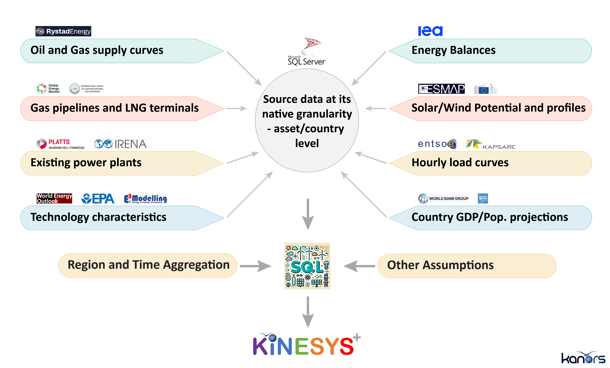
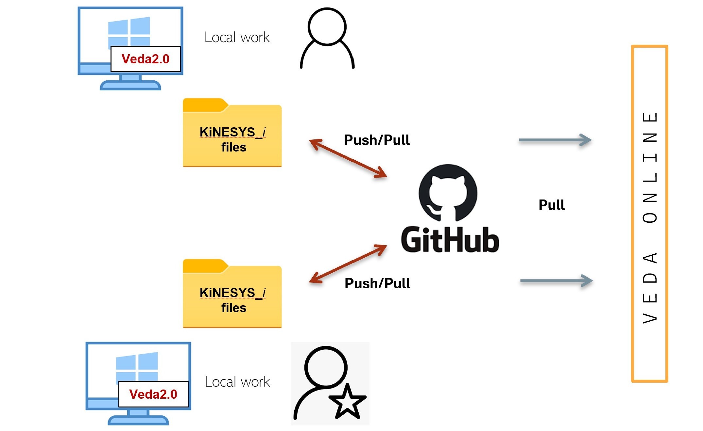

############
Introduction
############

What is KiNESYS+?
-----------------

KiNESYS+ (**Knowledge-based Investigation of Energy System Scenarios**) is a data warehouse and data management system that supports the creation of energy models through a highly configurable and modular framework. It provides a centralized environment where energy system data, assumptions, and configurations are stored, managed, and transformed into operational models. The system grows with each new engagement, and non-confidential data enriches future instances.

**The framework is developed and managed by KanORS-EMR**, drawing on decades of experience with global, regional, and national models including SAGE, TIAM, Pan-EU TIMES, and FACETS.

Users access pre-configured instances of KiNESYS models, tailored to specific regional, national, or sectoral contexts. These instances are designed to address particular modeling objectives and retain the flexibility of any well-built Veda-TIMES model. KanORS can reprocess them through the framework, making even structural changes relatively straightforward.

A KiNESYS instance is a practical starting point for users new to Veda-TIMES, especially those interested in conducting sectoral or regional analyses using normative (policy objectives) or simulation (policy measures) scenarios. **It is particularly suited for users whose primary goal is not to become modeling experts but to effectively use a robust energy model to inform policy development, strategic planning, or investment analysis.**

.. raw:: html

    Here are some <a href="https://vedaonline.cloud/kanors/kinesys.html" target="_blank"><b>examples</a></b> of KiNESYS models.

Motivation
----------

*Energy system models need to be built faster*
    The need for energy system modeling is increasing due to rapid transitions in the energy sector. Understanding cross-sector interactions is important for driving system change. There is a need to address urgent short-term issues within a long-term context, considering multiple intersecting uncertainties.

    The TIMES modeling framework is flexible and feature-rich, but building models takes considerable time and demands substantial effort for enhancements and updates. Additionally, TIMES models are often inaccessible to those outside the TIMES modeling community. To be an effective user, one typically must become a TIMES expert first.

    There is a need for a *nimble modeling* approach in addressing energy-related questions, especially those with a global scope and varying regional or technological focuses. Whether exploring hydrogen scenarios, understanding LNG supply and trade, or ensuring energy security in specific regions, a one-size-fits-all model with static regional and temporal aggregation is often not the best option.

*Need to widen engagement with models*

    Wider Engagement Brings Diverse Perspectives:

        * Cross-Disciplinary Insights: When diverse experts engage with model results, they bring unique perspectives that can lead to more comprehensive insights. A power systems expert or a national energy planner might identify issues that the core modeling team overlooked.
        * Different Questions: Diverse perspectives often lead to different questions being asked and additional patterns being identified.
        * Enhanced Understanding: When stakeholders are directly involved in analyzing and interpreting results, they develop a deeper understanding of the findings.

    Stakeholders Using Insights More Efficiently:

        * Direct Engagement: Allowing stakeholders to interact with models directly can shorten the decision-making process. Instead of waiting for analyses from the core team, they can query the model for insights relevant to their specific concerns.
        * Tailored Insights: Different stakeholders have varied informational needs. Direct access to models allows them to extract the specific data points most relevant to their tasks or decisions.

*Modeling teams need to collaborate*

    Isolated energy modeling teams can be suboptimal due to the immense detail embedded in these models across regions, sectors, and technologies. No single team can thoroughly explore every modeling dimension, validate all assumptions, or identify all potential oversights. Streamlined sharing of data improvements and modeling practices would improve the quality of models and modeling.

The KiNESYS methodology addresses these three challenges. This approach is designed to make energy system modeling more intuitive, flexible, and accessible, enhancing its utility for policy formulation and energy research. The goal is to make complex energy system models accessible to domain experts and stakeholders with a high-level understanding of modeling.

The Three Pillars of KiNESYS+
-----------------------------

Creating Instances of KiNESYS Models
^^^^^^^^^^^^^^^^^^^^^^^^^^^^^^^^^^^^

**Core Concept**
    The first pillar focuses on the **rapid creation of customized energy models** at the global, regional, or national level. Unlike traditional model-building, which envisions a single, static model built from pre-processed data, KiNESYS leverages data management techniques and Veda-TIMES expertise developed over decades. This approach transforms model creation from a time-consuming process into a more efficient, scalable one.

**Data Structure and Content**
    KiNESYS integrates a variety of global energy datasets, including:

        - **Asset-Level Databases:** Power plants, gas and oil pipelines, LNG terminals, steel and cement plants from sources like Platts and Global Energy Monitor.
        - **Energy Supply & Demand Data:** IEA energy balances, World Bank WDI (for sectoral GDP shares), SSP Database (for macroeconomic drivers), and GLOBIOM forecasts (for biomass potential).
        - **Renewable Resource Data:** Solar/wind potentials from ESMAP, MERRA2 solar/wind profiles, and load shape data.
        - **Sectoral Data:** Renewable power capacities from IRENA, vehicle stocks, industrial production statistics from USGS and FAOStats.

    Data is stored in a **relational database** in its **native form**, ensuring easy updates and smooth incorporation of new versions. **SQL scripts** process this data into Veda-compatible Excel input files, supporting custom regional aggregation and configuration. See :doc:`Data_sources` for a complete list.

**Demand Projection Methodology**
    Energy demands are projected using econometrically estimated elasticities that link sectoral demands to macroeconomic drivers (GDP, population, households, and derived indicators). The appropriate driver for each region-sector combination is determined empirically based on historical fit, ensuring that projections reflect observed relationships rather than theoretical assumptions. See :doc:`Demand_projection` for details.

**Model Customization**
    - **Supply Side:** Asset-level modeling allows customization by plant size, cooling technology, and more.
    - **Demand Side:** Sectors like industry and transport can be modeled with aggregated or detailed assumptions, balancing model complexity and output precision.

**Scenario Exploration Types:**
    1. **Normative Scenarios:** Identify cost-effective pathways to achieve policy targets like emissions reductions.
    2. **Simulation Scenarios:** Analyze system responses to specific policy interventions, such as fossil fleet retrofit or phaseout plans.

**Default Coverage:**
    The default configuration covers oil, gas, coal, solar, wind, hydropower, biomass potentials, CHP, transport, industrial sectors, and energy demands in buildings. Additional energy-economy sectors with material or energy flow linkages can be added as needed.

**Process and Workflow**
    1. **Data Integration:** Data remains in its native relational database format, ready for updates.
    2. **Data Processing:** 50-60 SQL scripts transform data into tables for Veda-TIMES input files.
    3. **Model Creation:** Custom models are assembled based on user-defined configurations.
    4. **Expert Management:** KanORS maintains control over the KiNESYS knowledge base, ensuring data accuracy, security, and continuous improvements.

**Key Advantages:**
    - **Accelerated Model Creation:** KiNESYS reduces model creation time from months to weeks, enabling teams to focus on analysis rather than model-building.
    - **Tested Framework:** KiNESYS benefits from continuous improvements across active models, reducing the need for extensive validation.

**Use Case Examples:**
    - **National Energy Plans:** Create sub-national models for targeted energy planning.
    - **International Policy Development:** Develop global or regional models preloaded with relevant sectors and regions.
    - **Policy Analysis for Utilities:** Explore compliance strategies for asset-specific upgrades or retirements.

.. seealso::

   For concrete examples including World Bank CCDRs, corporate transition planning, and multi-model research, see :doc:`Applications_and_Impact`.

   **The Knowledge Base of KiNESYS**

Continuously expanding granular data from various sources is aggregated and transformed via SQL scripts and other tools to populate Veda templates. The sectoral coverage of a typical model is shown below.

.. figure:: images/KiNESYS_RES.JPG
   :scale: 14%

   **Simplified RES of KiNESYS Models**

Deployment via Online Platforms
^^^^^^^^^^^^^^^^^^^^^^^^^^^^^^^

KiNESYS models are developed under Veda2.0 and deployed on Veda Online (VO). VO provides an interactive online platform that enables direct access to model inputs and outputs, facilitating real-time analysis and collaboration. This online accessibility ensures that complex models are within reach of a wider audience.

**Engaging Process for Progressive Fine-Tuning**

    * **Verification and Calibration**: KiNESYS prioritizes confidence in model outcomes through calibration checks and comparisons with external benchmarks. This process helps ensure the reliability of model predictions.

    * **Comprehensive Scenario Exploration**: The approach encourages investigation of diverse scenarios, focusing on the dynamics of fuel and technology transitions under various strategies.

    * **Collaborative Stakeholder Engagement**: KiNESYS emphasizes stakeholder involvement in refining models and shaping policy scenarios. This collaborative effort helps ensure that the modeling process remains relevant and aligned with current energy challenges.

The KiNESYS approach aims to make energy system modeling more accessible for policymakers and energy researchers, offering a tool for exploring complex energy dynamics and informing strategic decisions.

.. seealso::

   For examples of how online deployment has enabled World Bank CCDRs, corporate transition planning, and multi-model research, see :doc:`Applications_and_Impact`.

Collective Learning and Continuous Enhancement
^^^^^^^^^^^^^^^^^^^^^^^^^^^^^^^^^^^^^^^^^^^^^^

**Core Concept**
    The third pillar is centered on **Collective Learning** through a shared knowledge base (KB). Each KiNESYS instance is built from the same foundational KB, creating the opportunity for continuous enhancements driven by collaborative input across diverse teams. When one team updates or validates assumptions, those improvements can be propagated across other active KiNESYS instances (barring confidentiality issues). This structure supports a system where learning can continue across engagements.

Conventional models tend to be rigid and isolated, limiting systematic interaction between modeling teams. In contrast, KiNESYS creates a connected ecosystem where enhancements can be shared, reducing duplication of effort and enabling faster model improvements.

**Features and Technologies**
    The success of this pillar rests on data management expertise, supported by key technologies:

        - **SQL Scripts** for efficient data processing.
        - **GitHub Integration** for version control of model input files.
        - **VedaOnline Platform** for interrogation of model output and input.

**Key Impact Areas:**
    - **Demand-Side Modeling:** Since demand-side data is often less robust than supply-side data, collective learning enhances assumptions through expert review across regions and sectors.
    - **Technology Assumptions:** Teams focused on specific technologies like EVs or grid storage can benefit from validated assumptions from other expert teams in sectors like hydrogen, solar, wind, and CCS.

**Value Creation:**
    KiNESYS serves as a platform that has been reviewed and refined by experts spanning the energy system. This approach reduces the need for individual teams to validate the entire model, allowing them to focus on their specific research areas.

**Benefits for Stakeholders:**
    - **Policymakers:** Can work with a model built on shared, validated assumptions for evidence-based decision-making.
    - **Researchers and Businesses:** Save time and resources by relying on a tested, continuously updated modeling framework.

**Cross-Regional Relevance**
    Regions with less robust data that rely heavily on assumptions stand to gain the most, as cross-regional collaboration can fill knowledge gaps with expert-driven updates.

.. note::

    Knowledge transfer across KiNESYS instances is managed by the KanORS team. Updates and assumptions are only shared when teams agree to incorporate them, ensuring model integrity and team-specific customizations.

.. seealso::

   The collective learning pillar is demonstrated in practice through applications like the World Bank CCDRs and BP bioresource analysis, where assumption refinements in one project benefited others. See :doc:`Applications_and_Impact` for specific examples.

.. container:: analogy-box

    The Kitchen Analogy

    Another way to think about KiNESYS+: imagine a well-equipped kitchen managed by KanORS. In this kitchen, experienced chefs work with quality ingredients (global energy datasets) and tested recipes (SQL scripts and Veda-TIMES configurations) to prepare tailored meals for each guest.

    - The Kitchen (KiNESYS+): A centralized platform managed by KanORS, ensuring consistent, high-quality preparation.
    - The Dishes (KiNESYS Instances): Custom-built energy models tailored to specific requirements.
    - The Tableware (VedaOnline): The presentation layer that helps users appreciate and explore model insights.

    Guests can order the dishes and use the tableware, but the kitchen stays with KanORS.

Model Setup and Collaboration
-----------------------------

The process for setting up and collaborating on KiNESYS models is designed for efficiency, control, and flexibility:

1. **Repository Creation and Access**
    - KanORS creates a private GitHub repository containing the necessary model files.
    - Users are added as collaborators with read/write privileges.

2. **Local Cloning and Tool Integration**
    - Clone the repository locally using GitHub Desktop or a Git client.
    - Use the repository with Veda2.0 for local modeling tasks.
    - Provide access to the repository for VedaOnline using a Personal Access Token (PAT).
    - Create a model on Veda Online to browse input, create cases, run, and analyze model output.

3. **Model Updates**
    - KanORS pushes updates to the model periodically.
    - Users can pull these updates locally to keep their models synchronized.
    - Similarly, changes can be pulled on Veda Online to keep the VO version in sync.

4. **User Contributions and Reviews**
    - Users can make changes or enhancements to the model files and push updates to the repository.
    - KanORS reviews these changes to ensure they align with model requirements.

5. **Branching for Experimentation**
    - Users are encouraged to work on separate branches when testing deeper modifications.
    - This practice ensures the stability of the main branch while enabling exploration.

This workflow ensures efficient collaboration, version control, and model integrity while allowing users to experiment and enhance their models.

   **Collaborative use of a KiNESYS instance**

.. note::

    Veda2.0 is not a strict requirement but is recommended when users make structural modifications to models. It is a Windows application and does not work on Mac OS.

.. tip::

    For users unfamiliar with GitHub, KanORS provides support for repository setup and basic operations. See :doc:`GitHub_Desktop_Guide` for step-by-step instructions.

Future Vision
-------------

**Expansion:**
    As global energy data becomes more detailed, KiNESYS will integrate more granular, sub-national datasets. The process of creating KiNESYS instances will become increasingly automated, supporting faster and broader deployments.

**Long-Term Impact:**
    All Veda-TIMES models will have the option to start as a KiNESYS instance, offering a productivity boost for the global energy modeling community.

**Open Use Movement:**
    The methodologies and data processing architecture developed for KiNESYS have also informed **VerveStacks**, an open-use platform that extends similar automation capabilities to broader audiences. While KiNESYS+ remains the commercial platform managed by KanORS, VerveStacks represents an effort to democratize access to automated energy model generation.
