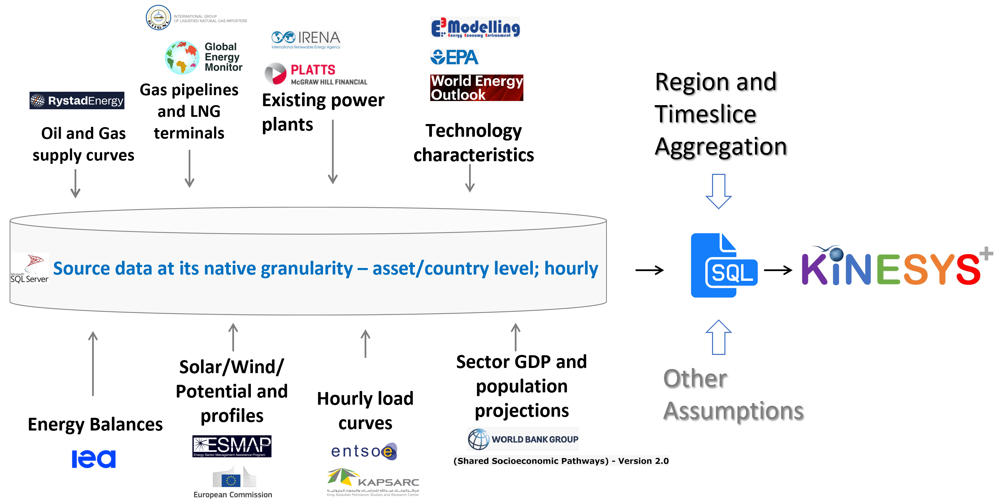
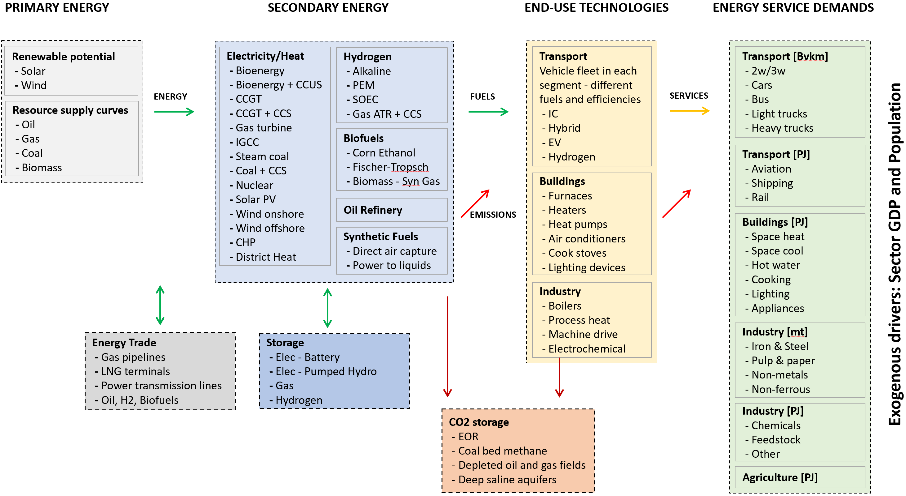

############
Introduction
############

KiNESYS+ (**Knowledge based Investigation of Energy system Scenarios**) is a bottom-up, technology rich, least-cost optimization, multi-regional global integrated assessment model,
which is developed using the TIMES model generator of IEA-ETSAP.

The need for energy system modeling is increasing due to rapid transitions in the energy sector. Understanding cross-sector interactions is crucial for driving system change.
There's a need to address urgent short-term issues within a long-term context, considering multiple intersecting uncertainties. To tackle these challenges, the ability to envision,
explore, and communicate disruptive scenarios is crucial.

The sophisticated and flexible TIMES modeling framework is a good platform to build energy system models. However, it takes a considerable amount of time to build, demands substantial effort
for enhancements and updates, and models built by one expert can be challenging to understand even for other TIMES experts. Additionally, TIMES models are practically inaccessible
to those outside the TIMES modeling circle. In a nutshell, to be an effective user, one MUST become a "TIMES expert" first.

There's a need for a *nimble modeling* approach in addressing energy-related questions, especially those with a global scope and varying regional/technological focuses.
Whether it's exploring global hydrogen scenarios, understanding LNG supply, demand, and trade, or ensuring energy security in specific regions,
a one-size-fits-all model with static regional and temporal aggregation is not the best option.

.. raw:: html

    <a href="https://vedaonline.cloud/kanors/kinesys.html" target="_blank"><b>Examples</a></b>

   **The Knowledgebase of KiNESYS**

   **Simplified RES of KiNESYS Models**