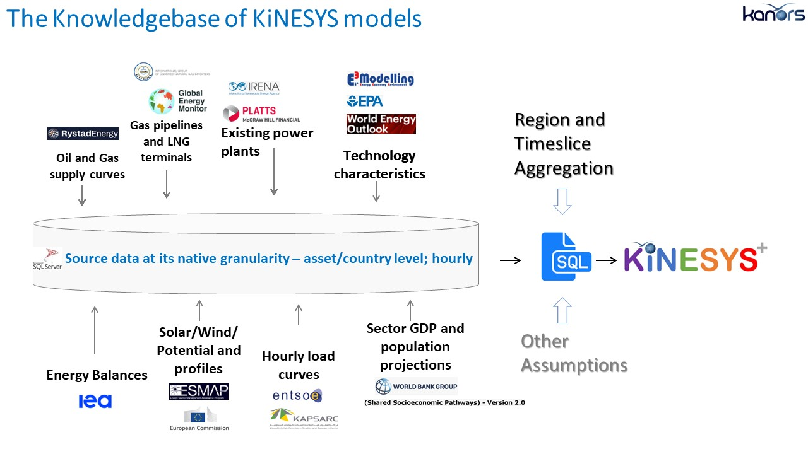
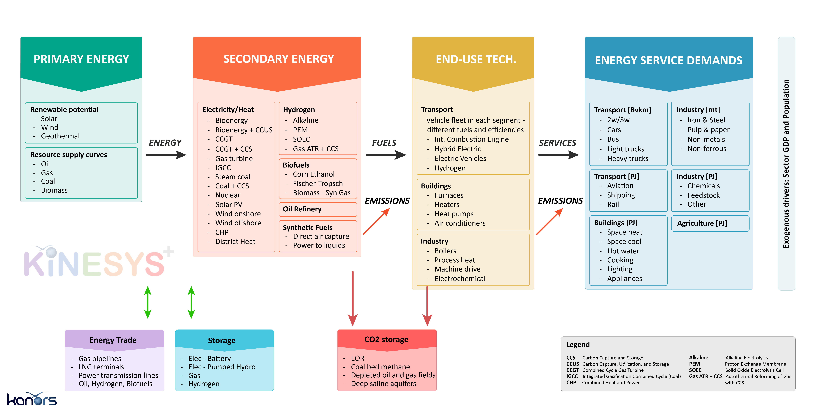

############
Introduction
############

KiNESYS+ (**Knowledge based Investigation of Energy system Scenarios**) is a bottom-up, technology rich, least-cost optimization, multi-regional global energy system model,
which is developed using the TIMES model generator of IEA-ETSAP.

Energy system models need to be built faster and better
    The need for energy system modeling is increasing due to rapid transitions in the energy sector. Understanding cross-sector interactions is crucial for driving system change.
    There's a need to address urgent short-term issues within a long-term context, considering multiple intersecting uncertainties. To tackle these challenges, the ability to envision,
    explore, and communicate disruptive scenarios is crucial.

    The flexible and feature-rich TIMES modeling framework is suitable to build energy system models, but it takes a considerable amount of time to build, demands substantial effort
    for enhancements and updates. Additionally, TIMES models are practically inaccessible
    to those outside the TIMES modeling circle. In a nutshell, to be an effective user, one MUST become a "TIMES expert" first.

    There's a need for a *nimble modeling* approach in addressing energy-related questions, especially those with a global scope and varying regional/technological focuses.
    Whether it's exploring global hydrogen scenarios, understanding LNG supply, demand, and trade, or ensuring energy security in specific regions,
    a one-size-fits-all model with static regional and temporal aggregation is not the best option.

Need to widen the engagement with models - beyond the core modeling team

    Wider Engagement Brings Diverse Perspectives:

        * Cross-Disciplinary Insights: When diverse experts engage with model results, they bring unique perspectives that can lead to more comprehensive insights. For example, a power systems expert or a national energy planner might identify anomalies that the core modeling team overlooked, offering valuable insights for the policy makers.
        * Innovative Problem-Solving: Diverse perspectives often lead to more creative and effective solutions. Different stakeholders might ask varied questions or spot additional trends.
        * Enhanced Understanding and Buy-In: When stakeholders are directly involved in analyzing and interpreting data, they're likely to have a deeper understanding of the results. This can lead to greater acceptance and support for data-driven decisions.

    Stakeholders Using Insights More Efficiently:

        * Direct Engagement with Models: Allowing stakeholders to interact with models directly can significantly shorten the decision-making process. Instead of waiting for analyses from the core team, they can query the model and get insights relevant to their specific concerns.
        * Tailored Insights for Specific Needs: Different stakeholders might have varied informational needs. Direct access to models allows them to extract the specific data points that are most relevant to their tasks or decisions.

.. raw:: html

    <a href="https://vedaonline.cloud/kanors/kinesys.html" target="_blank"><b>Examples</a></b>

   **The Knowledgebase of KiNESYS**

   **Simplified RES of KiNESYS Models**